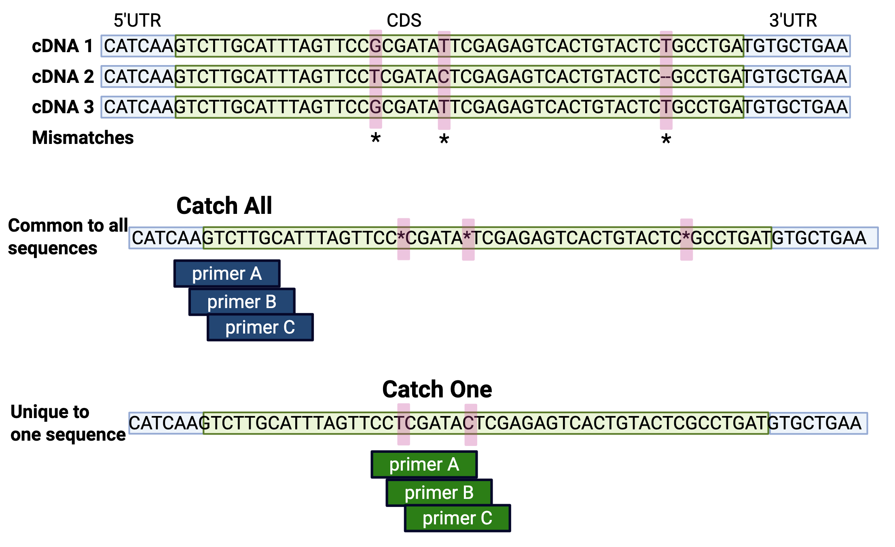
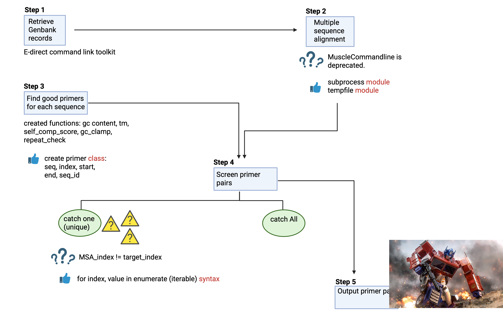

# OptimusPrymer

## Project for Automating the Design of both Specific and Degenerate PCR Primers

This repository contains pythons scripts for identifying PCR primers. Input file should be a plain text file with a single column of RefSeq ID's. By default, OptimusPrymer will automatically download genbank files for each ID, align them using MUSCLE3, identify degenerate primers combinations and write them to a text file in tabe seperated format. If you want specific primers, use the --catch flag to indicate which RefSeq ID specific primers should be created for. The only required input for OptimusPrymer is a text file, but users can optionally choose file handle (--output), minimum primer length (--minpl), and maximum primer length (--maxpl).

Example usage:
```
python3 optimus_prymer_main.py -input <text-file> -catch <sequence-id> --output <output-file-name> --minpl <20> --maxpl <22>
```

Contents of plain text file with RefSeq IDs:
```
NM_001008221.1
NM_000699.4
NM_020978.4
NM_001386925.1
NM_001008219.3
```
Here is a diagram of how --catch 'refseq-id' works


# CSHL Presentation


## Step 1 - Retrieve GenBank Files from NCBI (using Eentrez efetch)
* Creates a Sequence Object List
```
genbank_fetch_handle = Entrez.efetch(db = "nucleotide", id = seqid_list, rettype = "gb", retmode = "text" )
seq_object_list = list(SeqIO.parse(genbank_fetch_handle, "genbank"))
```

## Step 2 - Align Sequences with MUSCLE3
* Nucleic Acids Research, Volume 32, Issue 5, 1 March 2004, Pages 1792–1797
* Using subprocess() to run MUSCLE on command line
* Use a temporary file to prevent the generation of many fasta files
* Script returns a multiple sequence alignment (MSA) object
```
def align_muscle(seq_object_list):
    temp_align = gettempprefix()
    with NamedTemporaryFile(mode = "wt", prefix='muscle', delete_on_close=False) as temp_muscle:
        # writing in fasta format from the list of objects in seq_object_list, and save to temp_muscle
        for seq_object in seq_object_list:
            print(f">{seq_object.id}\n{seq_object.seq}", file = temp_muscle)
            # print(f">{seq_object.id}\n{seq_object.seq}")
        subprocess.run(["muscle", "-in", temp_muscle.name, "-out", temp_align])
    alignment_list = list(AlignIO.read(temp_align, "fasta"))
    return alignment_list
```


## Step 3 - Identifying all potential PCR primers
* Iterate across k-mer lengths (default is 20-22 nt)
* Check GC content
* Check for GC clamp
* Check for self-complementation (using Biopython Bio.Align)
* Check for Tm >50 and <80 C
* Check for mono- or di- nucleotide repeats
```
def self_complementary_check(sequence):
    """
    Align primer to its reverse complement using Bio.Align
    This returns an alignment score. Gaps >1 are not allowed.
    """

    if not isinstance(sequence, Seq):
        sequence = Seq(sequence.upper()) # create seq object if needed

    rev_com = Seq.reverse_complement(sequence)

    aligner = Align.PairwiseAligner() # create a pairwise aligner object
    aligner.mode = 'local'
    aligner.match_score = 1
    aligner.mismatch_score = -1
    aligner.open_gap_score = -2
    aligner.extend_gap_score = -10 # this prevents gap extension
    
    max_score = 0
    alignments = aligner.align(str(sequence), str(rev_com)) # perform alignment

    for align in alignments:
        if align.score > max_score:
            max_score = align.score
    
    if max_score > 8:
        if debug:
            print(f"Warning: Primer has a self complentary score of {max_score}", file = sys.stderr)

    return(max_score) # return the highest self complement alignment score
```

* Created a PrimerObject class to store information about each primer
```
# define the PrimerObject class
class PrimerObject:
    # set attributes of PrimerObject
    def __init__(self, seq, start, end, tm, direction, seq_id, index = -1):
        self.seq = seq
        self.start = start
        self.end = end
        self.index = index
        self.tm = tm
        self.direction = direction
        self.seq_id = seq_id
```


## Step 4 - Screening PCR primer pairs
* User input determines whether program:
    * Identifies Unique Sequence Loci (--catch 'sequence-id')
        * Parse the MSA object to identify loci with unique sequences ('A', 'T', 'C', 'G' or '-')
        * Convert the unique loci positions from MSA format to position in original sequence
            * MSA position [0:10] ATC-----GC  = Original position [0:5] ATCGC
        * Filter primers to determine if they overlap unique sequences

```
            Unique Sequence Ranges:
            Sequence start: 0, Sequence end: 15
            Sequence start: 16, Sequence end: 52
            Sequence start: 53, Sequence end: 91
            Sequence start: 92, Sequence end: 116
            Sequence start: 117, Sequence end: 143
            Sequence start: 144, Sequence end: 165
            Sequence start: 166, Sequence end: 199
            Sequence start: 1117, Sequence end: 1119
            Identified 534 unique primers
```

    * Identifies Degenerate (Common) Primers (--catch 'All')
        * Use PCR primers that were identified multiple times (from multiple sequnces) in Step 3

* Screen primer pairs
    * ΔTm < 5
    * Amplicon size > 50 bp and < 200 bp

## Step 5 - Write Compatible Primer Pairs to Ouptut File
* User can customize output 'filename' using --output flag


## Final Takeaways
* enumerate() is a very useful function for working with data objects
```
for ind, current_value, in enumerate(unique_pos_list):
        if ind > 0: # ensure not first element
            if current_value - previous_value <= 5:
                # Start tracking a new range if we don't have one started
                if range_start is None:
                    range_start = previous_value
                
                # If this is the last element or next element is not consecutive, end the range
                if ind == len(unique_pos_list) - 1 or unique_pos_list[ind + 1] - current_value > 5:
                    if range_start is not None:
                        consecutive_ranges.append((range_start, current_value))
                        #print(f"Consecutive range: {range_start} to {current_value}")
                        range_start = None
            else:
                # Gap is too large, end any current range
                if range_start is not None:
                    consecutive_ranges.append((range_start, previous_value))
                    #print(f"Consecutive range: {range_start} to {previous_value}")
                    range_start = None
```

* Creating classes is sometimes easier than making dictionaries of dictionaries of dictionaries
* Gaps in alignment are not necessarilly useful for desinging PCR primers (when the gap in alignment is at the beginning of a sequence)
* If you want to check for complementarity between two sequences (ie primers) by doing an alignment you always reverse complement one of the sequences.


